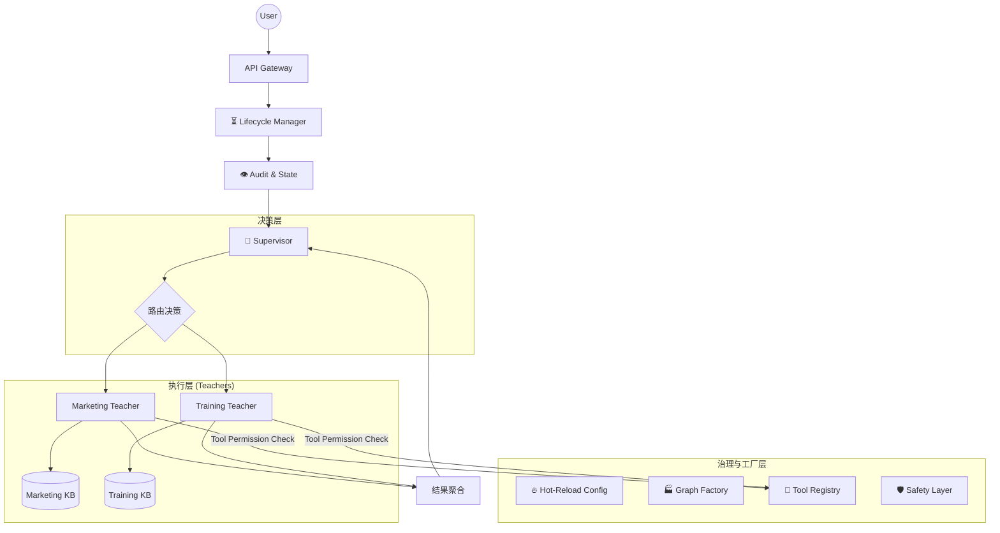

# AI 多老师智能体系统 (Nexus) - 架构设计文档 [Universe Final V1.0]

## 1. 项目元数据

* **项目名称**: `ai-teacher-nexus`
* **核心模式**: `LangGraph Supervisor Pattern` (多智能体主管模式)
* **工程等级**: **工业级平台 (Industrial Platform)**
* **交付目标**: 支撑两人团队开发，具备完整生命周期管理、权限控制、热更新能力、审计追踪与多模态演进的智能体操作系统。
* **项目结构**: 一个“面向真实用户的网站级 Agent 应用”，其技术内核 = DeepSeek（LLM） + RAG（业务知识） + LangGraph（流程与角色）
---

## 2. 核心设计原则（The Constitution）

| 原则         | 定义                          | 落地约束                              |
| ---------- | --------------------------- | --------------------------------- |
| **强物理隔离**  | 每个 Teacher = 独立目录 + 独立子图    | 新增老师严禁修改 Supervisor 代码            |
| **无知之幕**   | Supervisor 不知道 Teacher 内部逻辑 | 仅通过标准 State 交互，禁止跨层调用             |
| **配置即代码**  | Prompt / Config 版本化管理       | Python 代码中不得硬编码 Prompt，支持热加载      |
| **最小权限原则** | Tool 必须注册与授权                | Marketing Teacher 无法调用删除数据库等高权限工具 |
| **防御性编程**  | 假设一切皆会失败                    | 必须有熔断、重试、兜底、边界检查机制                |
| **状态向后兼容** | State 演进不破坏旧会话              | 新增字段必须 Optional 或含默认值             |
| **生命周期管控** | 无状态服务，有状态会话                 | Session 必须显式管理创建、持久化、销毁           |
| **执行审计**   | 所有行为可追踪                     | 记录 Node 执行、输入输出、Tool 调用、耗时、Token  |

---

## 3. 系统全景心智模型（Mental Model）



---

## 4. 工程目录结构

```text
ai-teacher-nexus/
├── config/
│   ├── settings.py
│   └── prompts/
│       ├── _base.yaml
│       ├── supervisor.yaml
│       └── teachers/
│           ├── marketing/
│           │   ├── v1.0.yaml
│           │   └── latest.yaml
│           └── training/
│               ├── v1.0.yaml
│               └── latest.yaml
│
├── logs/
│   └── audit.jsonl
│
├── tests/
│   ├── unit/
│   ├── integration/
│   ├── prompt/
│   ├── teacher/
│   └── regression/
│
├── src/
│   ├── main.py
│
│   ├── core/
│   │   ├── factory.py         # Graph 编译与运行工厂
│   │   ├── lifecycle.py       # Session/Task 生命周期管理
│   │   ├── state_mgr.py       # State 演进与兼容
│   │   ├── config_mgr.py      # 配置热加载 & Prompt 版本回滚
│   │   ├── prompt_mgr.py      # Prompt 加载器
│   │   ├── audit.py           # 执行级审计 & 行为日志
│   │   ├── safety.py          # 安全检查、拒绝协议
│   │   ├── memory.py          # Memory 分层模型
│   │   └── hitl.py            # HITL 人类介入治理闭环
│
│   ├── supervisor/
│   │   ├── graph.py
│   │   ├── router.py
│   │   └── nodes.py
│
│   ├── teachers/
│   │   ├── base.py             # Teacher 标准接口
│   │   ├── marketing/
│   │   │   ├── graph.py
│   │   │   ├── nodes.py
│   │   │   ├── state.py
│   │   │   ├── boundaries.yaml
│   │   │   └── capability.yaml
│   │   └── training/
│   │       ├── graph.py
│   │       ├── nodes.py
│   │       ├── state.py
│   │       ├── boundaries.yaml
│   │       └── capability.yaml
│
│   └── shared/
│       ├── rag/
│       │   ├── retriever.py    # 多模态演进接口占位
│       │   └── vector.py
│       └── tools/
│           ├── registry.py     # Tool 治理与权限
│           └── lib/
│               ├── web_search.py
│               ├── calculator.py
│               └── db_query.py
│
└── data/
    └── knowledge/
        ├── marketing/
        └── training/
```

---

## 5. 核心模块职责说明

### 5.1 核心设计原则

* 强物理隔离、无知之幕、最小权限、配置即代码、防御性编程、状态向后兼容、生命周期管控、执行审计。

---

### 5.2 Teacher 标准接口

* 新增老师必须新建文件夹。
* 实现 `compile_graph()` 方法返回 `CompiledGraph`。
* 输入输出必须遵循全局 State 协议。

---

### 5.3 Supervisor 调度职责

* 接收 User Query + Chat History。
* 调用 PromptManager 加载 `supervisor.yaml`。
* 调用 LLM 进行意图分类。
* 根据边界和安全策略决定路由节点。
* **禁止**直接生成业务回答。

---

### 5.4 交互数据流（标准流程）

1. 用户请求 -> API Gateway -> Lifecycle Manager
2. Session 初始化 / 检查
3. ConfigManager 加载 Prompt
4. Supervisor 意图识别 -> 路由
5. GraphFactory 编译子图
6. Teacher 执行 Plan -> Execute -> Review
7. ToolRegistry 权限检查
8. RAG 检索 (多模态)
9. AuditLogger 记录行为、耗时、Token
10. Supervisor 聚合结果
11. 返回 User
12. Session 更新与归档

---

### 5.5 Teacher 能力边界声明

* `boundaries.yaml` 与 `capability.yaml`
* 校验 query 是否越界，违规则抛异常或返回拒绝标识

---

### 5.6 Prompt 治理层

* 所有 Prompt 存放 YAML
* PromptManager 动态加载
* 支持热更新与版本回滚

---

### 5.7 失败与拒绝协议

* Supervisor 路由失败 -> Fallback
* RAG 检索为空 -> NoKnowledge
* 超出 Teacher 能力范围 -> Boundary Refusal
* 统一使用 State `status` 字段标记：SUCCESS / REFUSAL / FALLBACK

---

### 5.8 知识库责任边界

* RAG Retriever 必须传入 `namespace`
* Marketing / Training 等知识库物理隔离
* 禁止全局 Retriever

---

### 5.9 执行级审计 & 行为日志

* 记录 Node 执行、输入输出、Tool 调用、耗时、Token
* HITL 事件可追踪
* 存储 `logs/audit.jsonl` 或接 ELK / Observability 系统

---

### 5.10 Prompt / Teacher 行为测试

* 单元测试：边界检查、Prompt 加载
* 集成测试：完整 Teacher Graph 流程
* Evals 测试：输出内容、长度、Emoji、结构等

---

### 5.11 退化 / 降级策略

* LLM 降级：DeepSeek -> GPT-4o -> Local Rule
* Tool 失效：降级回答
* RAG 不可用：Teacher 自动切换闲聊模式

---

### 5.12 State 演进与兼容策略

* State 包含 `_meta.version`
* Lazy Migration 填充新字段默认值
* 向后兼容旧会话

---

### 5.13 Session / Task 生命周期管理模块

* SessionManager：创建 / 销毁 / 归档
* 控制上下文窗口（Token 上限）
* 支持长会话、短会话、话题切换

---

### 5.14 Tool 治理（Tool Registry & Permission）

* 工具注册、权限分配
* Teacher 调用前必须检查权限
* 防止乱用高权限操作

---

### 5.15 多模态演进接口占位层

* Retriever 支持文本 / 图片 / 视频 / 音频
* 返回 `SearchResult` 多模态结构
* Teacher 可直接使用，无需改动核心逻辑

---

### 5.16 Graph 编译与运行工厂层

* GraphFactory 统一编译 Graph
* 自动注入 Checkpointer、AuditLogger、异常处理
* 支持 Human-in-the-loop 断点

---

### 5.17 配置热加载 & Prompt 版本回滚

* ConfigManager 支持动态读取 Prompt
* 支持回滚 `latest.yaml` 到旧版本

---

### 5.18 Agent 级能力声明 / 自描述模块

* `capability.yaml` 描述 Teacher 功能
* Supervisor 可用作路由判断依据

---

### 5.19 人类介入（HITL）治理模块闭环

* GraphFactory / Node Wrapper 支持 HITL
* HITL 事件触发时阻塞 LLM，等待人工确认
* HITL 行为记录在 Audit 日志

---

### 5.20 Memory 分层模型

* 多层 Memory：Session Memory / Global Memory / Tool Memory
* Checkpointer 支持 Redis / Local
* 保证 State 演进和历史可回溯

---

